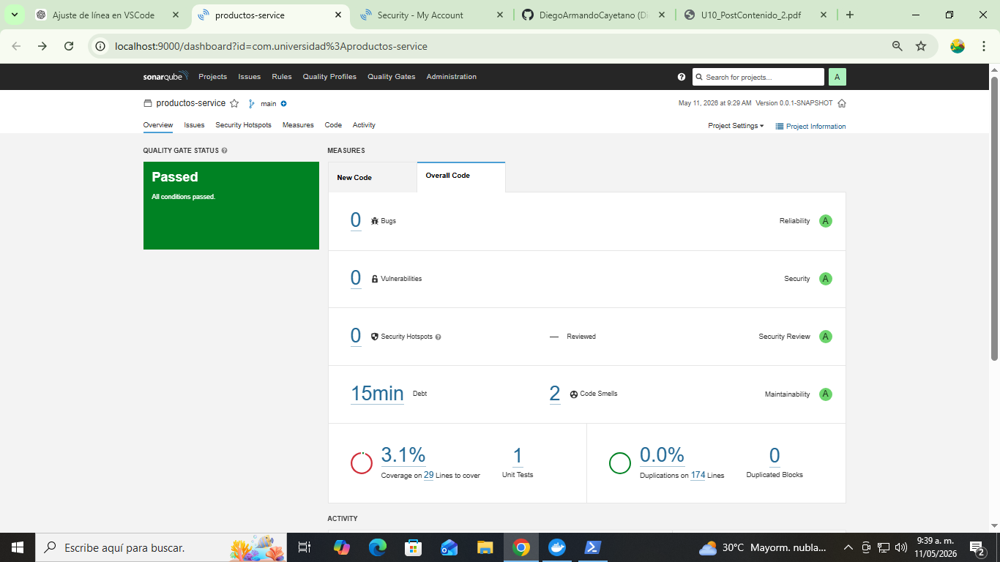
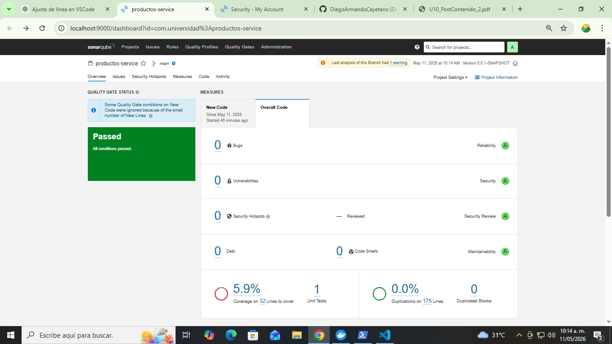
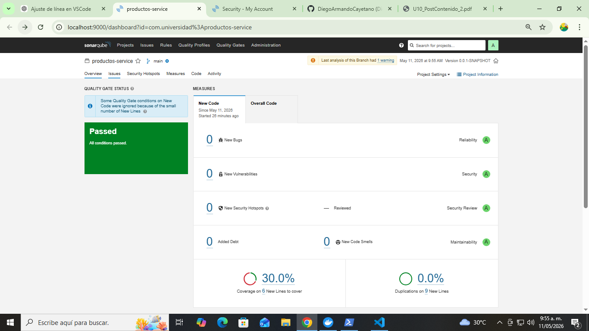
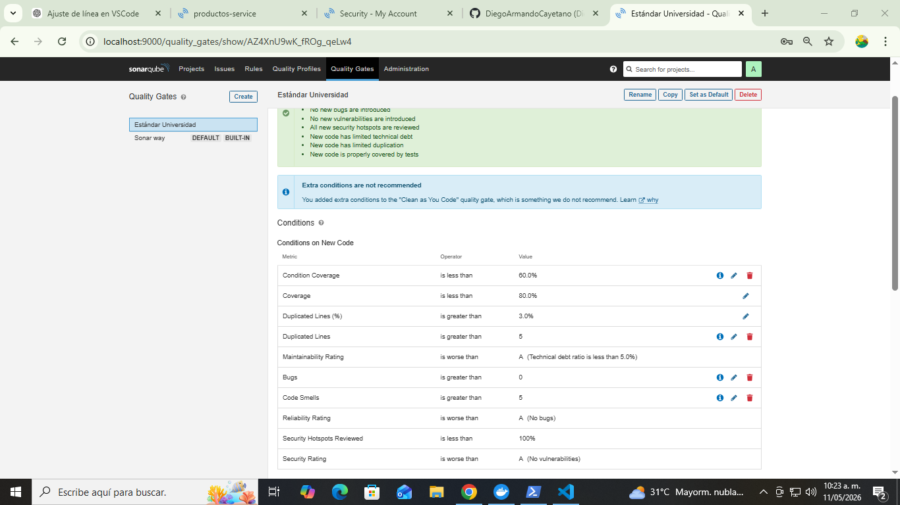

# 🧪 Productos Service - Análisis de Calidad con SonarQube

## 📌 Información del proyecto
- Proyecto: productos-service  
- Tecnología: Spring Boot + Maven + Java 21  
- Herramienta de calidad: SonarQube (Local - Docker)  
- Autor: Estudiante Ingeniería de Sistemas  

---

## 🎯 Objetivo de la actividad

Configurar un Quality Gate personalizado en SonarQube, corregir Code Smells y Bugs detectados, mejorar métricas de calidad del código y automatizar el análisis con GitHub Actions.

---

## ⚙️ Configuración realizada

### 🔹 SonarQube
- Servidor local en Docker: http://localhost:9000  
- Proyecto analizado: `com.universidad:productos-service`

### 🔹 Quality Gate personalizado
Nombre: **Estándar Universidad**

Condiciones:
- Bugs > 0 ❌
- Vulnerabilities > 0 ❌
- Code Smells > 5 ❌
- Coverage < 60% ❌
- Duplicated Lines > 5% ❌

---

## 🛠️ Correcciones realizadas

### ✔ Bug corregido
Se eliminó el retorno de `null` en el método de búsqueda y se reemplazó por excepción controlada:

```java
.orElseThrow(() -> new NoSuchElementException("Producto no encontrado"));

## 📸 Evidencias del proyecto

### 🔹 Quality Gate configurado


### 🔹 Código corregido


### 🔹 Código refactorizado


### 🔹 Dashboard SonarQube



Autor
Diego Armando
